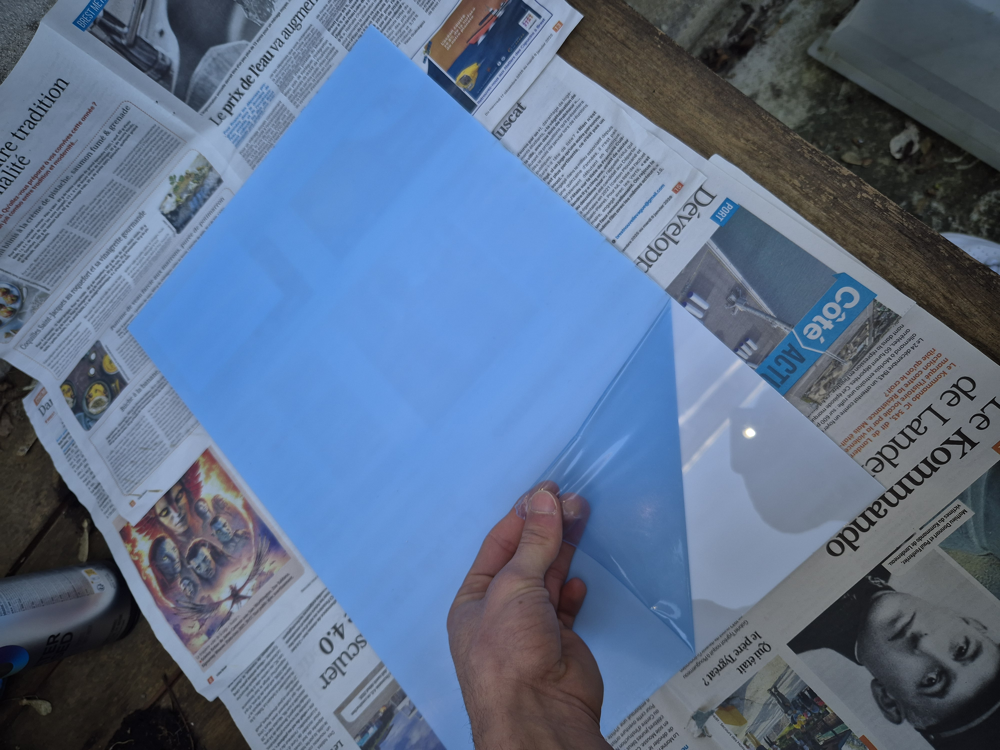
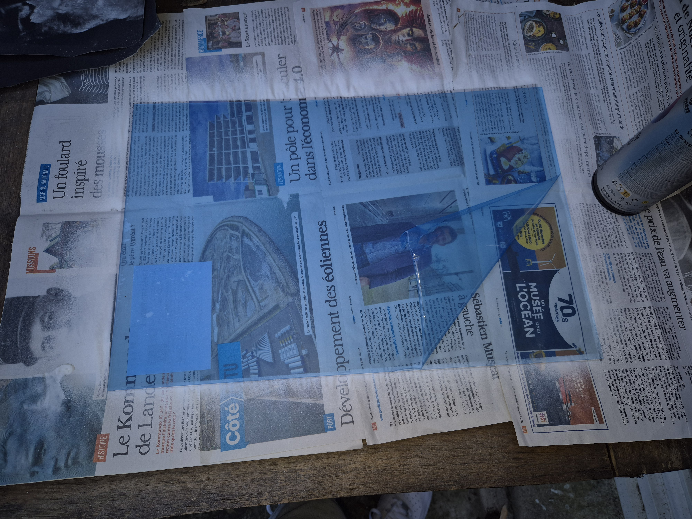
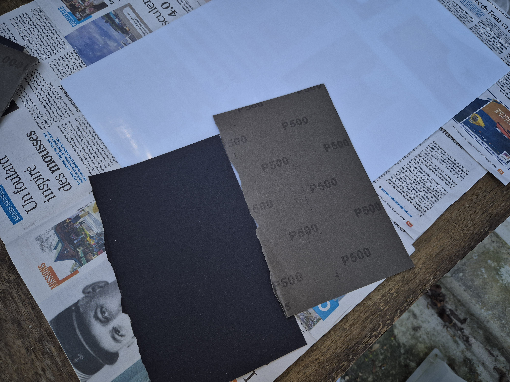
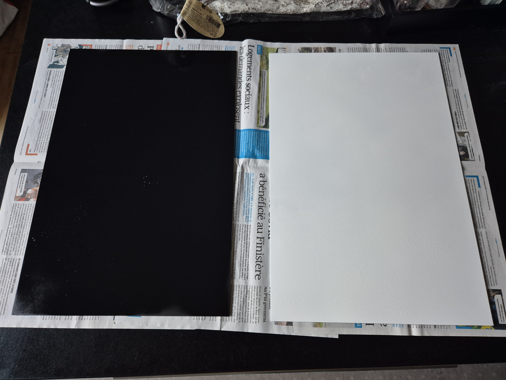
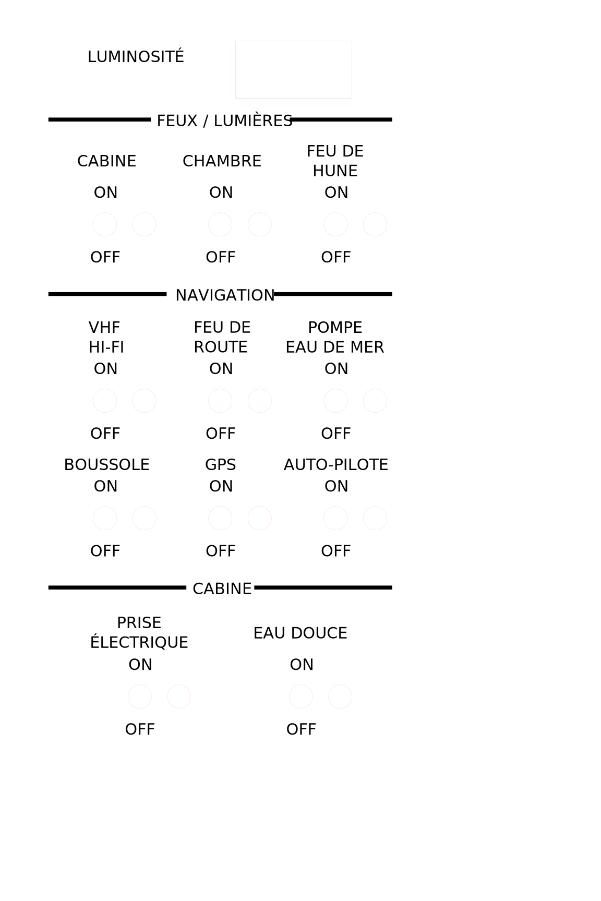

# Backlight panel (Panneau rétroéclairé)

Afin de réaliser le panneau rétro-éclairé, je me suis basé sur le tutoriel suivant : https://github.com/RandieBarsteward/Complete-Unified-Nested-Throttle-System/wiki/Flight-Panel-Build

## Préparation

Pour réaliser le panneau, vous devez avoir 2 plaques, une plaque arrière en PMMA extrudé opaque qui va permettre la diffusion de la lumière, et une plaque transparante (aussi PMMA extrudé) qui sera elle à l'avant du panneau.

Chaque plaque recevra une couche de peinture sur un côté, et les deux plaques seront collés entre elle sur la face peinte. Voici un schéma représentatif :

```
ASCII schéma
```

Premièrement, retirez le plastique de protection :




Avant d'appliquer la peinture, il est conseillé de poncer légèrement les 2 plaques pour que la peinture adhère mieux.



Le P500 était suffisant mais visuellement je dirais qu'un P300 aurait été plus adapté.

## Peinture

Pour la peinture, j'ai utilisé de la peinture en spray diluée à l'eau.
Une seule couche n'était pas suffisant, je voyais trop la lumière au travers de la plaque et ce n'était pas uniforme (certaines parties était plus opaque que d'autres).

Pour les couleurs, j'ai décidé de peindre la plaque opaque (arrière) en blanc, et la plaque transparante (avant) en noir.

Voici le résultat :



## Découpes et gravures (Laser)

La dernière étapes consiste à découper et graver les plaques à l'aide d'un laser.

Pour ce faire, vous devez réaliser un dessin en suivant les consignes pour votre découpeuse laser. Dans mon cas, un trait de 0.05mm rouge (RGB 0,0,255) correspond à une découpe et toutes les parties noires (RGB 0,0,0) des gravures.

Voici le SVG de mon panneau, je vous conseille de faire des essais sur des vieux calendrier avant de passer sur les plaques PMMA, pour vous éviter quelques surprises de passage à taille réelle.

Pour la conception du dessin, j'ai utilisé le logiciel [InkScape](https://inkscape.org/)



## Assemblage et résultat


## Retour d'expérience